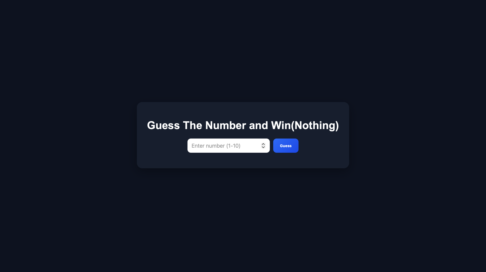

# Number Guess Game

A simple and interactive number guessing game built using JavaScript.

## 🚀 Live Demo
👉 https://sahilsingh-js.github.io/number-guess-game/

## 📸 Preview

## 🧠 Features
- Random number generation
- Input validation
- Attempts counter
- Feedback messages (Too High / Too Low)
- Shake animation on wrong input

## 🛠️ Tech Stack
- HTML
- CSS
- JavaScript (DOM Manipulation)

## 📚 What I Learned
- DOM manipulation
- Event handling
- Conditional logic
- User input handling

## 🎮 How to Play
1. Enter a number between 1–10
2. Click "Guess"
3. Get feedback and try again!

---

💡 Built as part of my JavaScript learning journey 🚀
